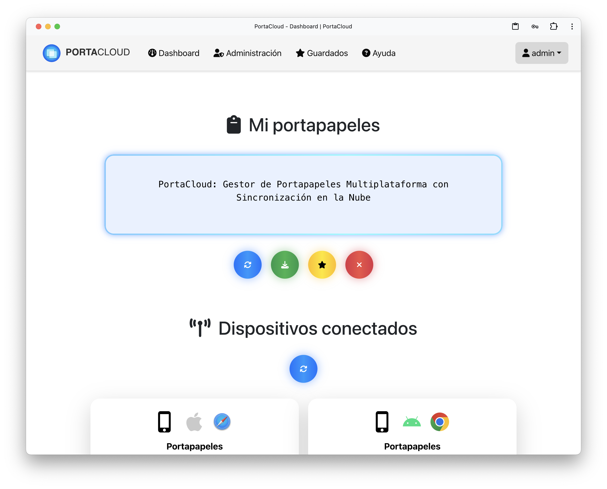

# PortaCloud: Gestor de Portapapeles Multiplataforma con Sincronización en la Nube  
Trabajo de Fin de Grado para el Grado en Ingeniería Informática. Universidad de Córdoba (UCO)



---

## 📚 Tecnologías utilizadas

- **Backend:** Node.js, Express.js  
- **Frontend:** React.js (Next.js)  
- **Base de datos:** MongoDB (MongoDB Atlas)  
- **Autenticación:** Passport.js (JWT)  
- **Control de versiones:** Git  
- **Despliegue backend:** Render  
- **Despliegue frontend:** Vercel  

---

## 🌳 Estructura del proyecto

- `backend/`: Código del servidor  
  - `models/`: Modelos Mongoose para MongoDB (User, Device, SavedItem, Log, etc.)  
  - `routes/`: Rutas REST para usuarios, dispositivos, autenticación, administración, imágenes, etc.  
  - `controllers/`: Controladores con la lógica de negocio para cada ruta  
  - `middleware/`: Middleware personalizado, por ejemplo para gestión de subida de archivos  
  - `config/`: Configuraciones, como Passport para autenticación  
  - `utils/`: Funciones auxiliares para autenticación, limpieza, manejo de datos de dispositivos  
  - `temp_uploads/`: Carpeta temporal para archivos subidos (no versionada)  

- `frontend/portacloud/`: Código cliente con Next.js  
  - `app/`: Páginas principales organizadas por rutas 
  - `components/`: Componentes reutilizables, incluyendo navbar, footer y ventanas modales
  - `context/`: Contexto React para manejo global del estado de autenticación  
  - `public/`: Recursos públicos como iconos, imágenes  

---

## 🚀 Despliegue local

### Requisitos previos

- Node.js y npm instalados  
- MongoDB Atlas configurado (string de conexión en `.env` backend)  

### Backend

```bash
cd backend
npm i
node server.js
```

El backend corre por defecto en `http://localhost:5000` (revisar configuración).  

### Frontend

```bash
cd frontend/portacloud
npm i
npm run dev -p 3000
```

Frontend disponible en `http://localhost:3000`  

---

## 🌍 Despliegue online

- **Backend:** https://portacloud-backend.onrender.com  (y en servidor alternativo)
- **Frontend:** https://portacloud.vercel.app  
- **Base de datos:** MongoDB Atlas (servicio en la nube)  

---

## ⚙️ Funcionalidades principales

- Registro, inicio y gestión segura de usuarios con JWT y Passport  
- Gestión de dispositivos vinculados al usuario  
- Sincronización en la nube del portapapeles entre dispositivos  
- Guardado, edición y eliminación de contenidos sincronizados  
- Administración de usuarios y dispositivos (panel de administrador)  
- Recuperación y restablecimiento de contraseña 
- Backup y descarga de datos  
- Interfaz responsive y accesible con Next.js y React  
- Gestión del estado global de autenticación y sesión  

---

## 🔧 Configuración y variables de entorno (backend)

- `MONGO_URI`: URL de conexión a MongoDB Atlas  
- `JWT_SECRET`: Clave secreta para la firma de tokens JWT  
- `PORT`: Puerto donde se ejecuta el backend (por defecto 5000)  
- `GMAIL_USER`: Cuenta de correo electrónico (de Gmail) usada para la recuperación de la contraseña
- `GMAIL_USER`: Contraseña (del tipo contraseña de aplicación) de la cuenta anterior
- `CLIENT_URL`: URL donde se encuentra el frontend
- `ENCRYPTION_SECRET_KEY`: Clave hexadecimal de 32 caracteres usada para la encriptación

---

## 📂 Base de datos

La base de datos usa MongoDB con las siguientes colecciones principales:

- **Users:** Datos de usuarios, credenciales, roles y tokens  
- **Devices:** Dispositivos asociados a usuarios para sincronización  
- **SavedItems:** Elementos guardados del portapapeles  
- **Logs:** Registro de eventos y acciones para auditoría  
- **ContentRegistry:** Registro de contenidos sincronizados  

---

