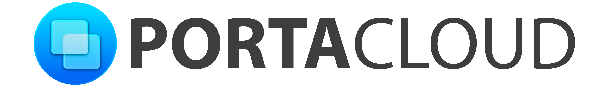
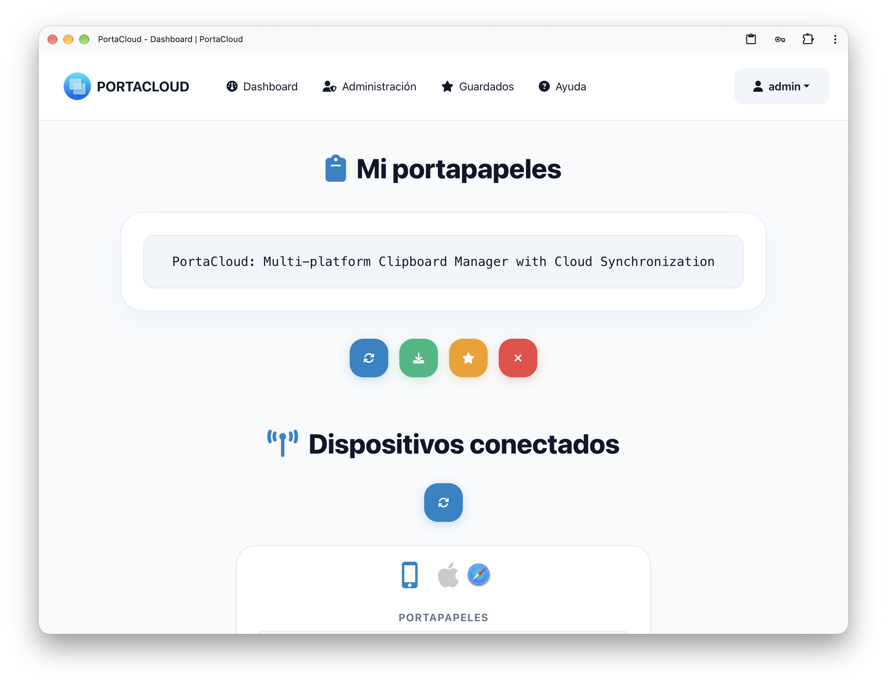

# PortaCloud: Multi-platform Clipboard Manager with Cloud Synchronization  
Final Degree Project for the Computer Engineering Degree. University of Córdoba (UCO)



---

## 📚 Technologies Used

- **Backend:** Node.js, Express.js  
- **Frontend:** React.js (Next.js)  
- **Database:** MongoDB (MongoDB Atlas)  
- **Authentication:** Passport.js (JWT)  
- **Version Control:** Git  
- **Backend Deployment:** Render  
- **Frontend Deployment:** Vercel  

---

## 🌳 Project Structure

- `backend/`: Server code  
  - `models/`: Mongoose models for MongoDB (User, Device, SavedItem, Log, etc.)  
  - `routes/`: REST routes for users, devices, authentication, administration, images, etc.  
  - `controllers/`: Business logic controllers for each route  
  - `middleware/`: Custom middleware (e.g., file upload handling)  
  - `config/`: Configuration files (Passport authentication setup)  
  - `utils/`: Helper functions (authentication, data sanitization, device data handling)  
  - `temp_uploads/`: Temporary folder for uploaded files (not version-controlled)  

- `frontend/portacloud/`: Next.js client code  
  - `app/`: Main pages organized by routes 
  - `components/`: Reusable components (navbar, footer, modals)
  - `context/`: React context for global authentication state management  
  - `public/`: Public assets (icons, images)  

---

## 🚀 Local Deployment

### Prerequisites

- Node.js and npm installed  
- MongoDB Atlas configured (connection string in backend `.env`)
  
### Backend

```bash
cd backend
npm i
node server.js
```

Backend runs by default at http://localhost:5000 (verify configuration).

### Frontend

```bash
cd frontend/portacloud
npm i
npm run dev -p 3000
```

Frontend available at http://localhost:3000

---

## 🌍 Online Deployment

- **Backend:** https://portacloud-backend.onrender.com
- **Frontend:** https://portacloud.vercel.app  
- **Database:** MongoDB Atlas (cloud service)  

---

## ⚙️ Key Features

- Secure user registration, login, and management using JWT and Passport  
- User device management  
- Cloud-based clipboard synchronization across devices  
- Creation, editing, and deletion of synchronized content  
- User and device administration (admin panel)  
- Password recovery and reset  
- Data backup and download  
- Responsive and accessible UI with Next.js and React  
- Global authentication and session state management  

---

## 🔧 Environment Variables (.env) - Backend

- `MONGO_URI`: MongoDB Atlas connection URL  
- `JWT_SECRET`: Secret key for JWT token signing  
- `PORT`: Backend port (default: 5000)  
- `GMAIL_USER`: Gmail account for password recovery  
- `GMAIL_PASS`: Application-specific password for the Gmail account  
- `CLIENT_URL`: Frontend URL  
- `ENCRYPTION_SECRET_KEY`: 32-character hex key for encryption  

---

## 🔧 Environment Variables (.env) - Frontend

- `NEXT_PUBLIC_SERVER_IP`: Backend URL  

---

## 📂 Database

MongoDB database with these main collections:

- **Users:** User data, credentials, roles, and tokens  
- **Devices:** User-associated devices for synchronization  
- **SavedItems:** Saved clipboard items  
- **Logs:** Action logs for auditing  
- **ContentRegistry:** Synchronized content registry  
